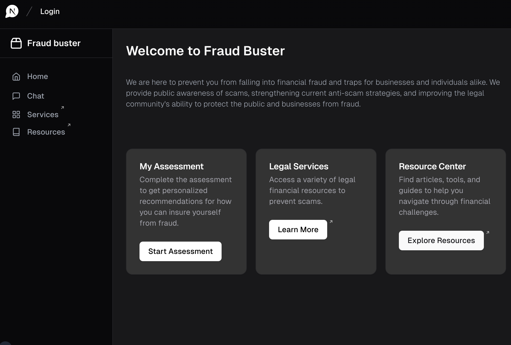
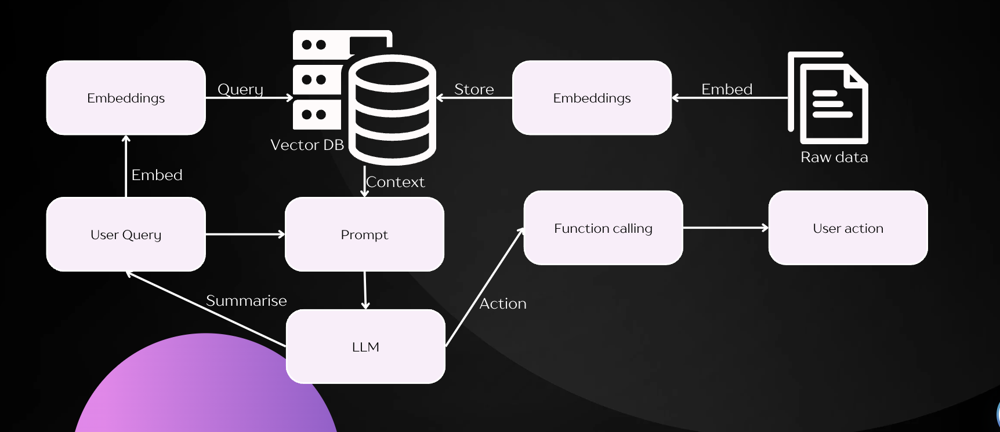
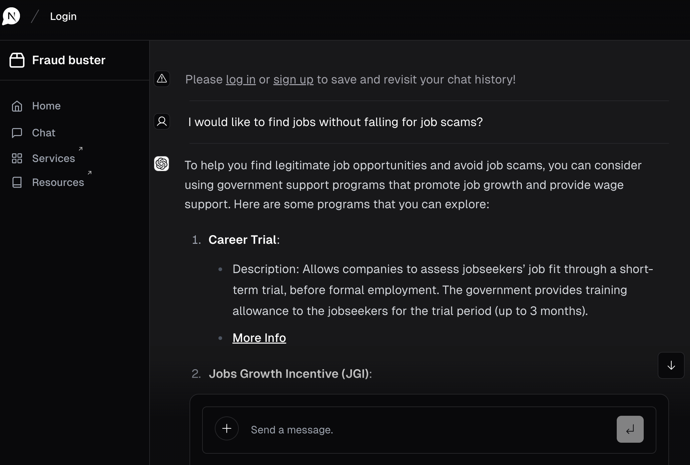
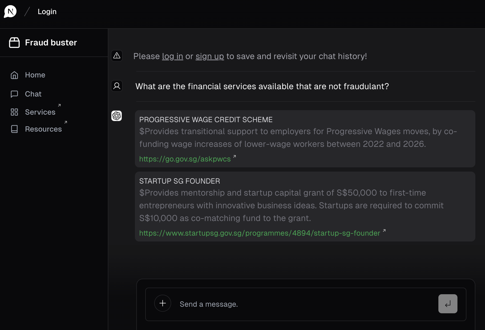

<a href="https://hackomania-govtech.vercel.app/">
  
  <h1 align="center">Fraud Buster</h1>
</a>

  An open-source AI chatbot app template built with Next.js, the Vercel AI SDK, OpenAI, and Vercel KV. This chatbot utilises RAG and vector database to educate the public and businesses from fraud.

  <a href="#features"><strong>Features</strong></a> ·
  <a href="#our-architecture"><strong>Our Architecture</strong></a> ·
  <a href="#chat-page"><strong>Chat Page</strong></a> ·
  <a href="#other-authors"><strong>Other authors</strong></a>

 

## Features

- [Next.js](https://nextjs.org) App Router
- React Server Components (RSCs), Suspense, and Server Actions
- [Vercel AI SDK](https://sdk.vercel.ai/docs) for streaming chat UI
- Support for OpenAI (default), Anthropic, Cohere, Hugging Face, or custom AI chat models and/or LangChain
- [shadcn/ui](https://ui.shadcn.com)
  - Styling with [Tailwind CSS](https://tailwindcss.com)
  - [Radix UI](https://radix-ui.com) for headless component primitives
  - Icons from [Phosphor Icons](https://phosphoricons.com)
- Chat History, rate limiting, and session storage with [Vercel KV](https://vercel.com/storage/kv)
- [NextAuth.js](https://github.com/nextauthjs/next-auth) for authentication

## Our Architecture

<a href="https://hackomania-govtech.vercel.app/">
  
  <h1 align="center">Application Design</h1>
</a>

This project make use of LLM with LangChain to provide information on fraud prevention. It also uses Retrieval Augmented Generation (RAG) and vector database from Supabase instance to reduce the search space for the LLM model and provide more accurate results.

## Our motivation

The inspiration for FraudGuard AI stemmed from witnessing the detrimental impact of scams on the financial well-being of victims. Our goal was to develop an AI-driven solution that educates and empowers users to safeguard their finances.

## Why this product

This product can:
- Raise public awareness of scams
- Strengthen current awareness of anti-scam strategies
- Improve the legal community's ability to protect the public and businesses from fraud

## Chat Page

Here is an example of the chat page. The chat page is designed to be simple and easy to use. The chatbot will provide information on government policies and regulations based on the user's input.

## Other Authors

This library is created by [Vercel](https://vercel.com) and [Next.js](https://nextjs.org) team members, with contributions from:

- Jared Palmer ([@jaredpalmer](https://twitter.com/jaredpalmer)) - [Vercel](https://vercel.com)
- Shu Ding ([@shuding\_](https://twitter.com/shuding_)) - [Vercel](https://vercel.com)
- shadcn ([@shadcn](https://twitter.com/shadcn)) - [Vercel](https://vercel.com)
